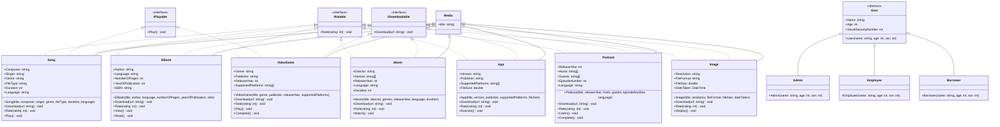

# oop-Workshop
Repository used for OOP Workshop

## UML Diagram

```mermaid
classDiagram
    %% Interfaces
    class IDownloadable {
        <<interface>>
        +Download(url: string) void
    }
    
    class IRatable {
        <<interface>>
        +Rate(rating: int) void
    }
    
    class IPlayable {
        <<interface>>
        +Play() void
    }
    
    %% Base Classes
    class User {
        <<abstract>>
        +Name: string
        +Age: int
        +SocialSecurityNumber: int
        +User(name: string, age: int, ssn: int)
    }
    
    class Media {
        +title: string
    }
    
    %% User Hierarchy
    class Admin {
        +Admin(name: string, age: int, ssn: int)
    }
    
    class Employee {
        +Employee(name: string, age: int, ssn: int)
    }
    
    class Borrower {
        +Borrower(name: string, age: int, ssn: int)
    }
    
    %% Media Types
    class EBook {
        +Author: string
        +Language: string
        +NumberOfPages: int
        +YearOfPublication: int
        +ISBN: string
        +EBook(title, author, language, numberOfPages, yearOfPublication, isbn)
        +Download(url: string) void
        +Rate(rating: int) void
        +View() void
        +Read() void
    }
    
    class Movie {
        +Director: string
        +Genres: string[]
        +ReleaseYear: int
        +Language: string
        +Duration: int
        +Movie(title, director, genres, releaseYear, language, duration)
        +Download(url: string) void
        +Rate(rating: int) void
        +Watch() void
    }
    
    class Song {
        +Composer: string
        +Singer: string
        +Genre: string
        +FileType: string
        +Duration: int
        +Language: string
        +Song(title, composer, singer, genre, fileType, duration, language)
        +Download(url: string) void
        +Rate(rating: int) void
        +Play() void
    }
    
    class VideoGame {
        +Genre: string
        +Publisher: string
        +ReleaseYear: int
        +SupportedPlatforms: string[]
        +VideoGame(title, genre, publisher, releaseYear, supportedPlatforms)
        +Download(url: string) void
        +Rate(rating: int) void
        +Play() void
        +Complete() void
    }
    
    class App {
        +Version: string
        +Publisher: string
        +SupportedPlatforms: string[]
        +FileSize: double
        +App(title, version, publisher, supportedPlatforms, fileSize)
        +Download(url: string) void
        +Rate(rating: int) void
        +Execute() void
    }
    
    class Podcast {
        +ReleaseYear: int
        +Hosts: string[]
        +Guests: string[]
        +EpisodeNumber: int
        +Language: string
        +Podcast(title, releaseYear, hosts, guests, episodeNumber, language)
        +Download(url: string) void
        +Rate(rating: int) void
        +Listen() void
        +Complete() void
    }
    
    class Image {
        +Resolution: string
        +FileFormat: string
        +FileSize: double
        +DateTaken: DateTime
        +Image(title, resolution, fileFormat, fileSize, dateTaken)
        +Download(url: string) void
        +Rate(rating: int) void
        +Display() void
    }
    
    %% Inheritance Relationships
    User <|-- Admin
    User <|-- Employee
    User <|-- Borrower
    
    Media <|-- EBook
    Media <|-- Movie
    Media <|-- Song
    Media <|-- VideoGame
    Media <|-- App
    Media <|-- Podcast
    Media <|-- Image
    
    %% Interface Implementations
    IDownloadable <|.. EBook
    IRatable <|.. EBook
    
    IDownloadable <|.. Movie
    IRatable <|.. Movie
    
    IDownloadable <|.. Song
    IPlayable <|.. Song
    IRatable <|.. Song
    
    IDownloadable <|.. VideoGame
    IPlayable <|.. VideoGame
    IRatable <|.. VideoGame
    
    IDownloadable <|.. App
    IRatable <|.. App
    
    IDownloadable <|.. Podcast
    IRatable <|.. Podcast
    
    IDownloadable <|.. Image
    IRatable <|.. Image
```
